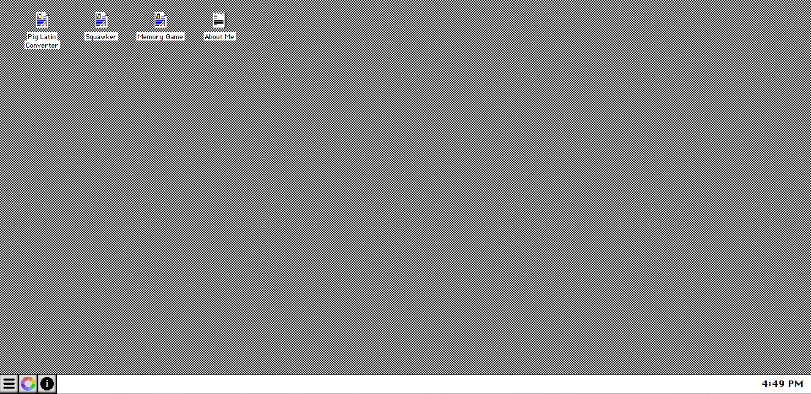
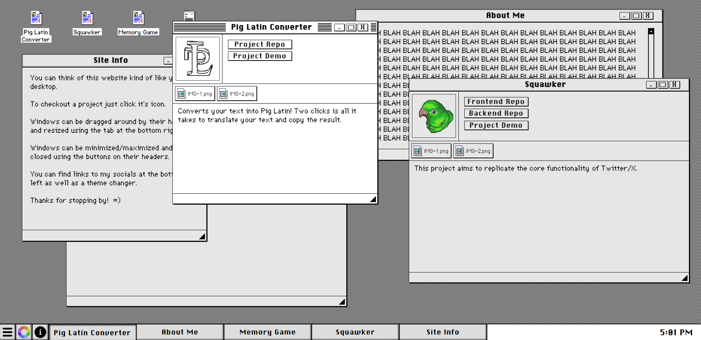

# Portfolio
A place for people to view my work, and find out how to contact me.\
\


## Installation
Run the following commands to install the project locally.
```
git clone git@github.com:99slayer/portfolio.git
cd portfolio
npm install
```
Use `npm run dev` to start the dev server, and view the app at http://localhost:5173.

## Technologies Used
- Typescript
- React
- Tailwind
- Vite
